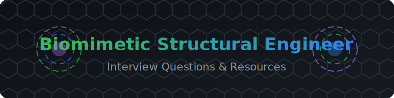

<div align="center">
  
</div>

<br />

# 🌿 Biomimetic Structural Engineer Interview Questions 🦴🏗️🐝

<p align="center">
  <a href="https://github.com/ishandutta2007/Awesome-Awesome-Awesome"></a><a href="https://discord.gg/jc4xtF58Ve"></a><a href="https://github.com/ishandutta2007"></a>
</p>

A curated, community-driven collection of interview questions (with model answers, frameworks, and explanations) for **Biomimetic Structural Engineer / Bio-Inspired Design Engineer** roles — spanning architecture and structural engineering firms, materials science companies, aerospace, and biomimicry-focused research labs. Explore top resources for structural engineering, biological abstraction, bio-inspired materials, generative design, and additive manufacturing.

> 📝 **A note on the title:** Titles in this space vary by organization — "biomimetic structural engineer," "bio-inspired design engineer," and "biomimicry consultant" are all used to describe overlapping work. This repo covers the underlying discipline (translating biological structural principles into engineered structures) regardless of which specific title a given employer uses.

This is not a list of trivia. Every question includes:
- **Why interviewers ask it**
- **A model answer or framework**
- **Follow-up questions** interviewers commonly use to probe deeper

> 🌱 This is v1. Contributions, corrections, and new questions are very welcome — see [CONTRIBUTING.md](CONTRIBUTING.md).

> ⚠️ **Note on scope:** This role sits at the intersection of structural/mechanical engineering, materials science, and biology. This repo assumes some existing background in engineering mechanics and/or biology, and focuses on the translation work between the two — abstracting biological principles into engineering solutions, not literally replicating organisms. Biomimicry is about function-driven abstraction, and good answers throughout this repo reflect that distinction rather than treating "copying nature" as literal imitation.

---

## 📚 Table of Contents 📑

| # | Category | What it covers |
|---|----------|-----------------|
| 1 | [Biomimicry & Bio-Inspired Design Fundamentals](questions/01-biomimicry-and-bio-inspired-design-fundamentals.md) | What biomimicry is, levels of abstraction, the design process |
| 2 | [Natural Structural Systems & Mechanics](questions/02-natural-structural-systems-and-mechanics.md) | How biological structures achieve strength, lightness, and toughness |
| 3 | [Bio-Inspired Materials & Manufacturing](questions/03-bio-inspired-materials-and-manufacturing.md) | Hierarchical materials, biomineralization, additive manufacturing |
| 4 | [Computational Design & Modeling](questions/04-computational-design-and-modeling.md) | Generative design, topology optimization, simulating biological structures |
| 5 | [Structural Engineering Fundamentals Applied to Biomimicry](questions/05-structural-engineering-fundamentals-applied.md) | Load paths, failure modes, translating biology into engineering constraints |
| 6 | [Case Studies in Biomimetic Applications](questions/06-case-studies-in-biomimetic-applications.md) | Well-known examples and what they actually teach about the design process |
| 7 | [Sustainability, Scalability & Building Codes](questions/07-sustainability-scalability-and-building-codes.md) | Manufacturing at scale, code compliance, honest sustainability claims |
| 8 | [Behavioral & Case Studies](questions/08-behavioral-and-case-studies.md) | Cross-disciplinary collaboration with biologists, real-world design tradeoffs |

Also see: [resources.md](resources.md) for external reading, key references, and communities.

---

## 🧭 How to Use This Repo 💡

- **Coming from a structural/mechanical engineering background?** Prioritize sections 2 and 6 first — you'll need working fluency in how biological structures actually achieve their mechanical properties, and enough case-study grounding to speak credibly about the field's landmark examples and their real lessons (not just the popular-science version).
- **Coming from a biology background moving into engineering design?** Prioritize sections 4 and 5 — the goal is building rigor in computational design tools and the engineering-mechanics translation work that turns a biological principle into a buildable structure.
- **Interviewing at an architecture/building-design-focused firm?** Focus heavily on sections 6 and 7.
- **Interviewing at a materials science or advanced manufacturing company?** Focus heavily on section 3.
- **Interviewing at an aerospace or product-design company?** Focus heavily on sections 2, 4, and 5.

Each question is tagged with a rough difficulty and role-level indicator:
- 🟢 Junior/Entry-level · 🟡 Mid-level Engineer · 🔴 Senior/Principal Engineer

---

## 🗂 Repo Structure 📂

```
biomimetic-structural-engineer-interview-questions/
├── README.md                                          ← you are here
├── CONTRIBUTING.md
├── LICENSE
├── resources.md
└── questions/
    ├── 01-biomimicry-and-bio-inspired-design-fundamentals.md
    ├── 02-natural-structural-systems-and-mechanics.md
    ├── 03-bio-inspired-materials-and-manufacturing.md
    ├── 04-computational-design-and-modeling.md
    ├── 05-structural-engineering-fundamentals-applied.md
    ├── 06-case-studies-in-biomimetic-applications.md
    ├── 07-sustainability-scalability-and-building-codes.md
    └── 08-behavioral-and-case-studies.md
```

## 🤝 Contributing 🌱

PRs are the whole point of this repo. If you were asked a question in a real interview that isn't here, add it! See [CONTRIBUTING.md](CONTRIBUTING.md) for format guidelines.

## 📄 License 📜

Content is available under [MIT License](LICENSE) — use it freely for your own prep, mock interviews, or hiring loops.

## ⭐ Support 🚀

If this helped you land an offer, consider starring the repo and adding the question that stumped you — it might help the next person.

##  Star History
<div align="center">
<a href="https://www.star-history.com/?repos=ishandutta2007%2FAwesome-Biomimetic-Structural-Engineer-Interview-Questions&type=date&legend=bottom-right">
<picture>
<source media="(prefers-color-scheme: dark)" srcset="https://api.star-history.com/chart?repos=ishandutta2007/Awesome-Biomimetic-Structural-Engineer-Interview-Questions&type=date&theme=dark&legend=bottom-right" />
<source media="(prefers-color-scheme: light)" srcset="https://api.star-history.com/chart?repos=ishandutta2007/Awesome-Biomimetic-Structural-Engineer-Interview-Questions&type=date&legend=bottom-right" />

</picture>
</a>
</div>
